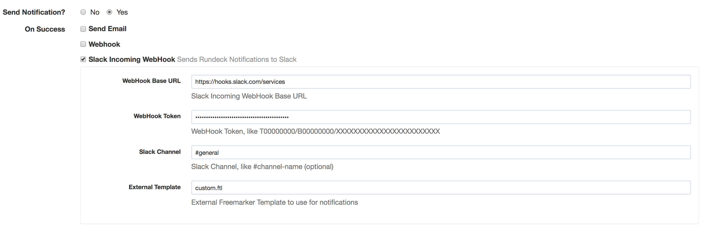

rundeck-slack-incoming-webhook-plugin
======================

Sends rundeck notification messages to a slack channel.  This plugin adds the ability to use customized templates (as [rundeck-slack-plugin](https://github.com/bitplaces/rundeck-slack-plugin) does) to [slack-incoming-webhook-plugin](https://github.com/rundeck-plugins/slack-incoming-webhook-plugin).

Installation Instructions
-------------------------

See the [Included Plugins | Rundeck Documentation](http://rundeck.org/docs/plugins-user-guide/installing.html#included-plugins "Included Plugins") for more information on installing rundeck plugins.

## Build

1. build the source with gradle
2. copy the jarfile to `$RDECK_BASE/libext`

## Configuration
This plugin uses Slack incoming-webhooks. Create a new webhook and copy the provided WebHook Token.

Copy any custom FreeMarker templates to `/var/lib/rundeck/libext/templates` and refer to them by file name in the External Template field. The External Template field is optional. If you do not provide an external template, the built-in template from `src/main/resources/templates/slack-incoming-message.ftl` will be used.

## Slack message example (from the built-in template)

On success.

On failure.

## Contributors
*  [kristalinc/slack-incoming-webhook-plugin](https://github.com/kristalinc/slack-incoming-webhook-plugin) code merge by: Gregory LeFevre @gl1f1v21
*  Original [hbakkum/rundeck-hipchat-plugin](https://github.com/hbakkum/rundeck-hipchat-plugin) author: Hayden Bakkum @hbakkum
*  Original [bitplaces/rundeck-slack-plugin](https://github.com/bitplaces/rundeck-slack-plugin) authors
    *  @totallyunknown
    *  @notandy
    *  @lusis
*  @sawanoboly
